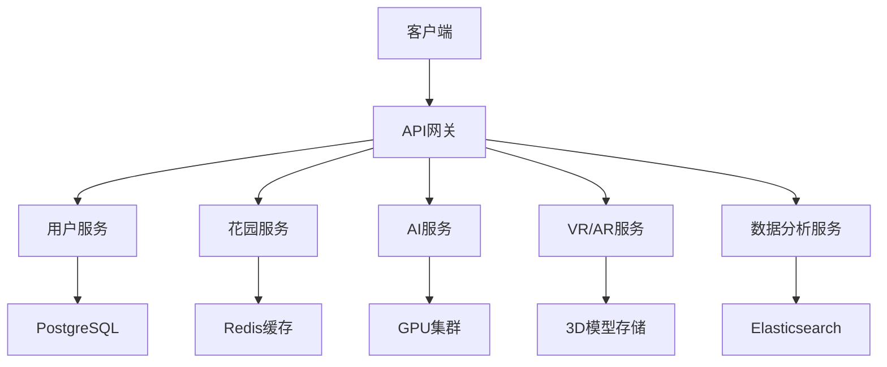
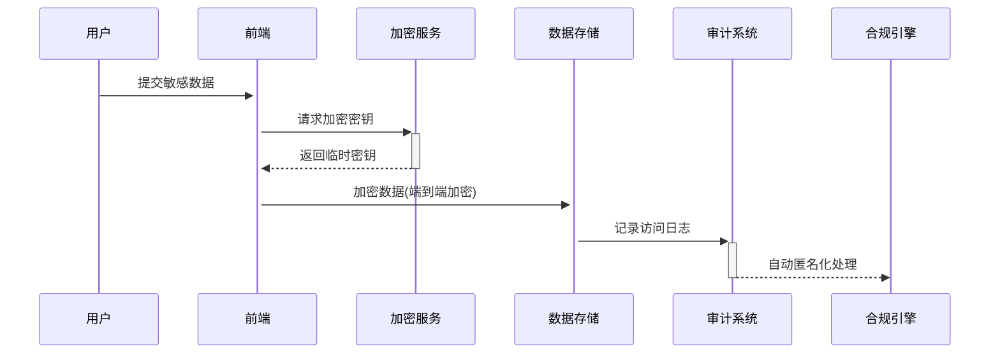
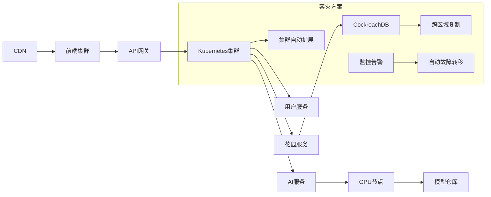

构建企业级的多功能心理治愈公益程序，需要从架构设计、技术选型、开发流程到部署运维进行全面规划。以下是完整的构建方案：

### 一、企业级架构设计


### 二、技术栈升级方案

| 模块 | 企业级技术方案 | 说明 |
|------|----------------|------|
| **前端架构** | React + TypeScript + WebAssembly | 类型安全+高性能3D渲染 |
| **3D引擎** | Unity WebGL + Three.js | 专业级吉卜力风格渲染 |
| **AI系统** | Kubeflow + TensorFlow Serving | 分布式AI模型部署 |
| **VR/AR** | WebXR + ARCore/ARKit | 跨平台沉浸式体验 |
| **后端服务** | Go + gRPC + Kubernetes | 高性能微服务架构 |
| **数据库** | CockroachDB + TimescaleDB | 分布式+时序数据库 |
| **实时通信** | WebRTC + WebSocket | 低延迟群体互动 |
| **监控系统** | Prometheus + Grafana + ELK | 全链路监控 |

### 三、核心模块企业级实现方案

#### 1. 吉卜力风格数字花园系统
```javascript
// Unity C# 实现示例
public class GhibliGarden : MonoBehaviour {
    [SerializeField] private EmotionData emotionData;
    [SerializeField] private GardenGrowthController growthController;
    
    void Update() {
        // 根据用户情绪状态调整花园
        if(emotionData.CurrentEmotion == EmotionType.Anxiety) {
            growthController.TriggerCalmAnimation();
            ParticleSystem.PlayHealingParticles();
        }
        
        // 根据用户互动增加花园元素
        if(UserInteractionManager.HasNewJournalEntry) {
            growthController.AddNewFlower();
            SpiritSystem.UnlockNewSpirit();
        }
    }
}
```

#### 2. 分布式AI情感引擎
```python
# Kubeflow管道示例
@component
def emotion_analysis(text: str) -> Dict:
    from transformers import pipeline
    analyzer = pipeline("text-classification", model="mentalhealth/ghibli-bert")
    return analyzer(text)

@component
def crisis_detection(emotion_data: Dict) -> bool:
    if emotion_data["score"] > 0.9 and emotion_data["label"] == "CRISIS":
        alert_system.notify_human_operator()
        return True
    return False

# 构建AI工作流
with dsl.Pipeline('mental_health_workflow') as pipeline:
    text_input = dsl.ParameterArgument(name="user_input")
    analysis_task = emotion_analysis(text=text_input)
    crisis_task = crisis_detection(emotion_data=analysis_task.output)
```

#### 3. 企业级安全架构


### 四、开发流程管理

1. **敏捷开发流程**：
   - 双周迭代 + DevOps自动化流水线
   - 基于GitOps的持续部署

2. **质量保障体系**：
   - 自动化测试覆盖率 > 85%
   - 压力测试：模拟10万并发用户
   - 安全扫描：OWASP ZAP + SonarQube

3. **伦理合规流程**：
   - 独立伦理委员会审查
   - 季度隐私保护审计
   - GDPR/HIPAA合规认证

### 五、部署架构



### 六、企业级特性实现

1. **全球低延迟访问**：
   - 边缘计算节点部署3D资源
   - WebAssembly模块化加载

2. **医疗级可靠性**：
   - 99.99% SLA保障
   - 实时健康检查+自动修复

3. **多租户支持**：
   ```yaml
   # Kubernetes命名空间隔离
   apiVersion: v1
   kind: Namespace
   metadata:
     name: partner-org-mentalhealth
     annotations:
       quota: "enterprise-tier"
   ---
   apiVersion: apps/v1
   kind: Deployment
   metadata:
     namespace: partner-org-mentalhealth
     name: ai-service
   ```

4. **数据分析看板**：
   - 实时情绪热力图
   - 治愈效果追踪报表
   - 用户参与度分析

### 七、运维监控体系

1. **全栈监控**：
   - 用户交互轨迹追踪
   - 3D渲染性能监控
   - AI模型推理延迟告警

2. **智能运维**：
   ```python
   # 异常检测算法
   def detect_anomaly(metrics):
       from sklearn.ensemble import IsolationForest
       clf = IsolationForest(contamination=0.01)
       predictions = clf.fit_predict(metrics)
       return np.where(predictions == -1)[0]
   ```

3. **灾难恢复**：
   - 跨云厂商备份策略
   - 30分钟RTO(恢复时间目标)
   - 15分钟RPO(恢复点目标)

### 八、企业级扩展方案

1. **API开放平台**：
   - 第三方心理咨询集成
   - 医疗机构数据接口

2. **硬件生态整合**：
   - VR头显设备深度优化
   - 生物传感器数据接入(心率、HRV)

3. **全球合规框架**：
   - 区域化数据存储策略
   - 多语言文化适配方案


### 十、成本优化策略

1. **AI成本控制**：
   - 模型量化(FP16->INT8)
   - 请求批处理+缓存
   - 冷热数据分层存储

2. **云资源优化**：
   ```bash
   # 自动伸缩配置
   kubectl autoscale deployment ai-service \
   --cpu-percent=70 \
   --min=3 \
   --max=50
   ```

3. **内容分发优化**：
   - 3D模型渐进式加载
   - WebP动画压缩
   - Brotli协议压缩

此方案满足企业级应用的：
- 高可用性（99.99% SLA）
- 医疗级数据安全（HIPAA/GDPR）
- 百万级用户扩展能力
- 多地域合规部署
- 专业级治疗效果追踪

